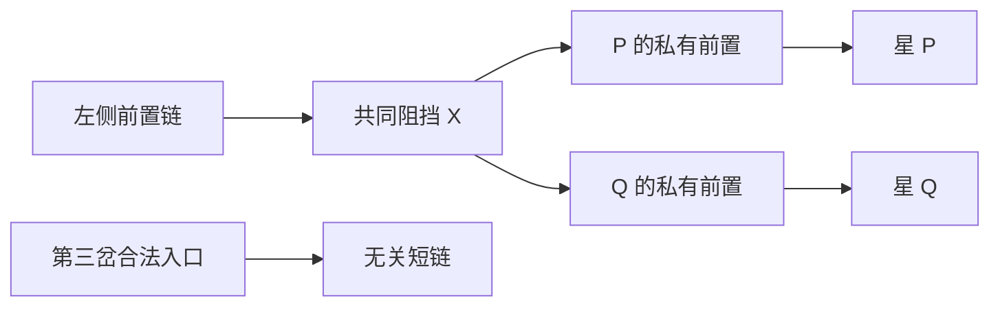
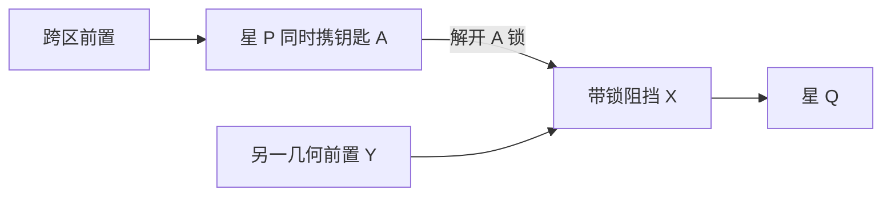
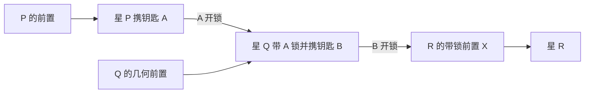
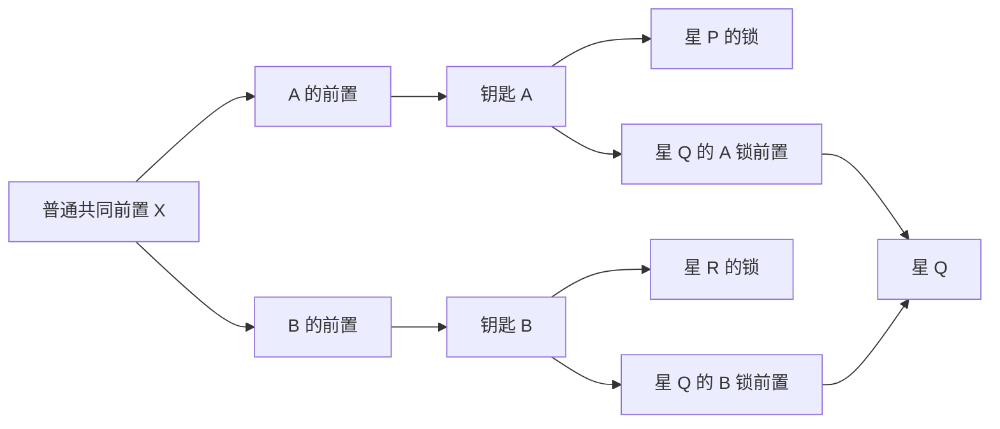
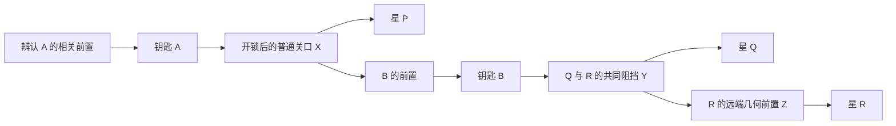

# 代表关卡的关键关系图

这些图表示设计角色之间的前置关系，不是箭头的空间走向，也不是完整棋盘坐标。`X → Y` 表示先解除 X 才能移除 Y；同一节点有多个前置时都必须满足。未展示的普通路径要在布局阶段补全并反向核查，不能用图的无环性宣称完整棋盘已可解。

## C031：熟手入口为何需要判断

关键是从两颗星认出共同 X，并留下第三岔。U 与 V 都合法后，先做哪个都可。若正式布局让第三岔也挡住 X，它就不再是无关支路，设计必须修正。预算按完整棋盘目标必需集合加 3 步，不能按上图节点数设置。

## C096：一次动作的两种进展

P离场同时完成一个目标并开锁，但X仍需Y移除后才可走。期望玩家能解释这两种收益，同时知道开锁不等于通路畅通。图标叠加必须保持尖端、星标、字母都可辨认。

## C133：两星接力

必须分别呈现权限和几何条件。最终布局不允许 U 或 V 反过来依赖 R/X，形成无法解开的环。玩家的贡献是辨认这条有条件的接力，不是被要求在两个等价合法动作中猜唯一顺序。

## C158：共同工作发生在钥匙之前

三个目标的权限要求不同；向前追到钥匙之前才发现共同X。Q需要两个不同带锁前置，不给单个箭头添加现有引擎不支持的“双锁”。

## C223：一关内的三次判断

布局应在三段各保留需要核对的对象及少量无关合法入口；否则图虽然分三段，玩家仍可能只是在跟一条显然的链点击。试玩关注实际何时重新思考，而不是仅数图中有三段。

## C291：后期综合题的边界

起手从内侧可读空列找到普通入口，解除A/B共同前置；中段分别核对两组权限；后段发现P/Q共享X、Q/R共享Y，P/R另有私有跨区阻挡。可留区贯穿三段。三个阶段的信息全部开局可见，不依靠隐藏目标或中途换规则。

制作时需要给出完整坐标、目标必需集合、至少一条可行解和多条合法顺序的中局记录。熟手能完成并不自动证明有挑战；还要看其能否指出关键判断、是否过早想通、是否觉得收尾重复。这一关尚未经过这些验证。
